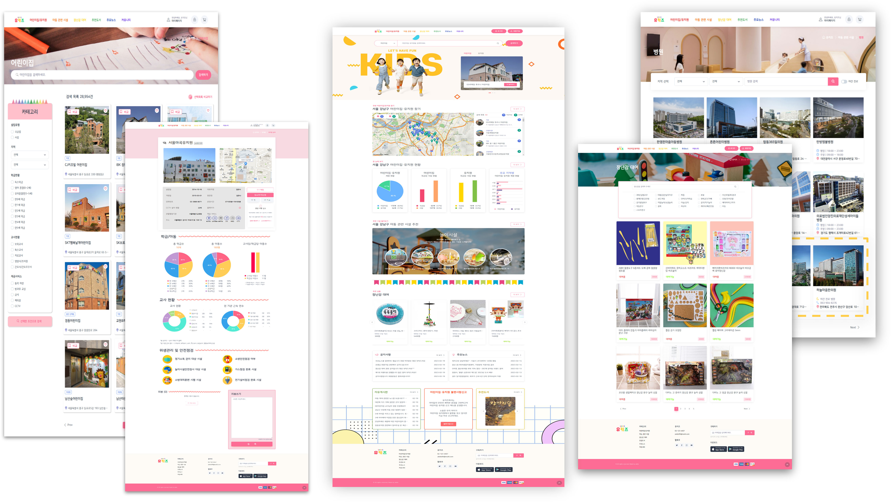

<h1>🚼 유키즈 - 아동 관련 시설 및 정보 플랫폼 </h1>


🔶  소개					SpringBoot를 활용한 아동 관련 시설 및 정보 사이트

🔷  관련 활동		   K-Digital Training 멀티캠퍼스

🕛  진행 기간           2023년 01월 09일 ~ 2023년 02월 21일


<br>

## 🔗 UIKDS - Github

- [Ukids - Github](https://github.com/93backend/ukids.git)

<br>


## 📄 상세 내용




``` 
💡 어린이집 / 유치원    어린이집/유치원 검색 및 조회 비교하기, 즐겨찾기, 1:1채팅 불편사항 신고, 입소 신청

   아동 관련 시설      아동복지시설 / 병원 / 놀이시설 검색 및 조회

   장난감 대여         장난감 검색 및 조회 대여하기, 장바구니, 결제

   추천도서            추천도서 검색 및 조회

   주요뉴스            주요뉴스 조회

   커뮤니티            글 조회, 작성, 수정, 삭제

   마이페이지          회원 정보 수정/탈퇴, 입소 신청 조회, 찜, 불편사항 신고 조회 내가 쓴 게시글, 대여내역 조회, 장바구니
   
   로그인 / 회원가입
```


| 🗣️ **언어** | 🕸️ **프레임워크/라이브러리** |  🛠️ **개발 도구**   | 🔱 **협업도구** |      📃  **API**      |
| :--------: | :-------------------------: | :----------------: | :------------: | :------------------: |
|    Java    |         SpringBoot          |      Eclipse       |      Zoom      | 어린이집정보공개포털 |
|   MySQL    |          Thymeleaf          | Visual Studio Code |     Notion     |   도서관 정보나루    |
| JavaScript |           JQuery            |   Apache Tomcat    |    Discord     |    국립중앙의료원    |
|   HTML5    |          BootStrap          |                    |     Github     |  건강보험심사평가원  |
|    CSS3    |           Mybatis           |                    |    ERDCloud    |      행정안전부      |
|    Ajax    |          Chart.js           |                    |  Google Drive  |      네이버뉴스      |
|            |           Lombok            |                    |                |    카카오 로그인     |
|            |                             |                    |                |      카카오 맵       |
|            |                             |                    |                |     토스페이먼츠     |


## 👧 담당한 기능

- UI 시안

  - 메인페이지

  - 어린이집 상세페이지

  - 장난감 대여 메인페이지

  - 장난감 대여 상세페이지

  - 결제 페이지

  - 회원 마이페이지

    - 회원정보 수정, 입소 신청 조회, 찜, 불편사항 신고 조회, 내가 쓴 게시글, 대여 내역 조회, 장바구니

  - 선생님 마이페이지

    - 회원정보 수정, 입소 신청 조회,불편사항 신고 조회 

 [UI시안(메인페이지,어린이집상세,장난감상세).pdf](project/UI시안(메인페이지,%20어린이집상세,%20장난감상세)%20.pdf) 

 [UI시안(장난감목록+결제+마이페이지(일반) + 마이페이지(선생님).pdf](project/UI시안(장난감목록%2B결제%2B마이페이지(일반)%20%2B%20마이페이지(선생님).pdf) 


- 프론트
  - header, footer (header.html, footer.html)
  - 장난감 대여 상세페이지 (toy-detail.html)
  - 병원 상세페이지 (hospital.html)
  - 아동복지 상세페이지 (welfare-detail.html)
  - 결제 (pay.html)
- 백엔드
  - 장난감 대여 페이지
    - 장난감 대여 메인(목록)
      - 장난감 검색
      - 장난감 필터 ( 체크박스)
      - 페이징
    - 장난감 대여 상세페이지
      - 장난감 기본 정보
      - 대여기간, 장바구니, 대여하기 (결제)
      - 장난감 상세 정보
      - 리뷰 작성 / 삭제
      - 비슷한 장난감
  - 결제
    - 주문자, 결제, 배송 정보
    - 토이페이먼프 SDK 를 통한 결제 ( 카드, 계좌이체)
  - 마이페이지 - 대여목록 조회 (도와줌)
    - 페이징
  
  

## 📄 Project 기획 * 개발

- [Final-Project 브레인 스토밍](ukids/Final-Project%20브레인스토밍.md)
- [Final-Project 브레인 스토밍2](ukids/Final-Project%20브레인스토밍2.md)
- [Final-Project 브레인 스토밍3](ukids/Final-Project%20브레인스토밍3.md)
- [Final-Project 기획](ukids/Final-Project%20기획.md)
- [Final-Project 기획2](ukids/Final-Project%20기획2.md)
- [Final-Project 기획3](ukids/Final-Project%20기획3.md)
- [Final-Project 개발(front)](ukids/Final-Project%20개발(front).md)
- [Final-Project 개인개발(front)](ukids/Final-Project%20개인개발(front).md)
- [Final-Project 개발(Backend)](ukids/Final-Project%20개발(Backend).md)
- [Final-Project 개인개발(Backend)](ukids/Final-Project%20개인개발(Backend).md)


## 💻 프로젝트 관련 자료

- **사이트 맵 및 기능리스트**

  [유키즈 마인드맵 및 기능리스트.xmind](project/유키즈%20마인드맵%20및%20기능리스트.xmind) 

  

- **UI 기획안**

  [UI시안(메인페이지, 어린이집상세, 장난감상세) .pdf](project/UI시안(메인페이지,%20어린이집상세,%20장난감상세)%20.pdf) 

  [UI시안(장난감목록+결제+마이페이지(일반) + 마이페이지(선생님).pdf](project/UI시안(UI시안(장난감목록%2B결제%2B마이페이지(일반)%20%2B%20마이페이지(선생님).pdf) 

  [UI시안(어린이집유치원메인, 어린이집유치원비교, 불편사항신고, 채팅).pdf](project/UI시안(어린이집유치원메인,%20어린이집유치원비교,%20불편사항신고,%20채팅).pdf) 

  [UI-디자인_유키즈_ 아동시설관련페이지_수정본.pdf](project/UI-디자인_유키즈_%20아동시설관련페이지_수정본.pdf) 

  [UI시안(도서목록, 주요뉴스, 게시판, 회원가입).pdf](project/UI시안(도서목록,%20주요뉴스,%20게시판,%20회원가입).pdf) 


- **ERD**
  


- **PPT**

 	 [유키즈_PPT.pdf](project/유키즈_PPT.pdf) 
