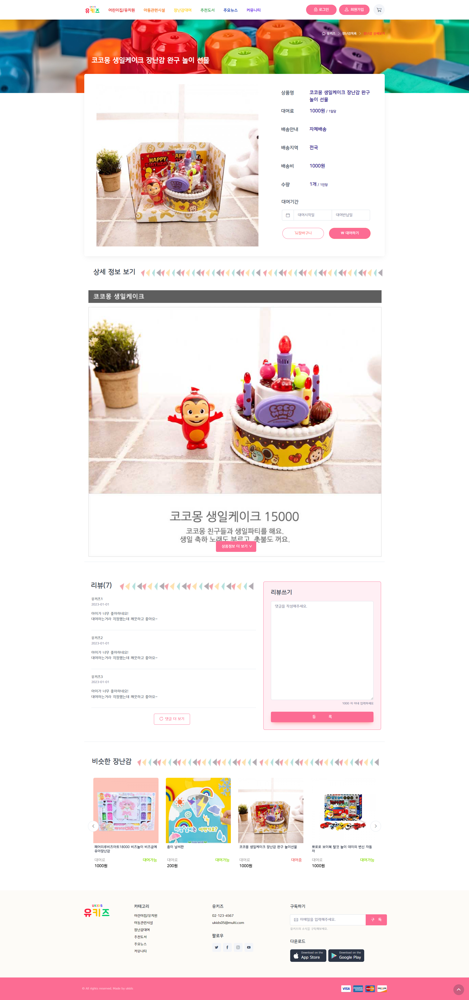
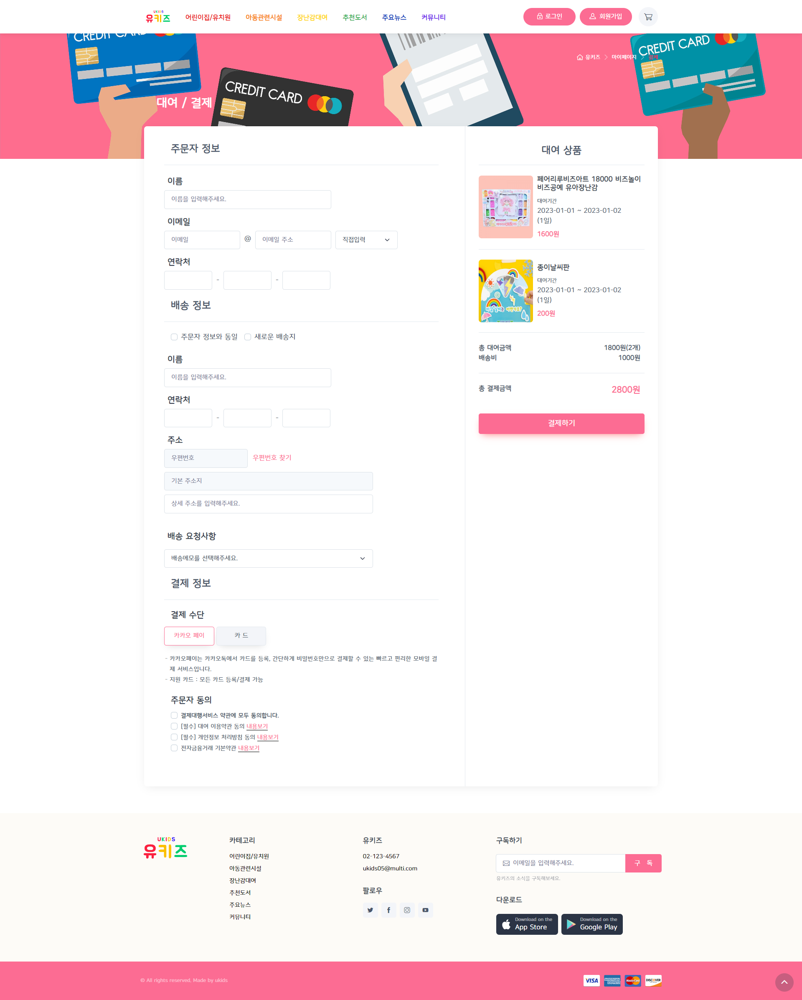
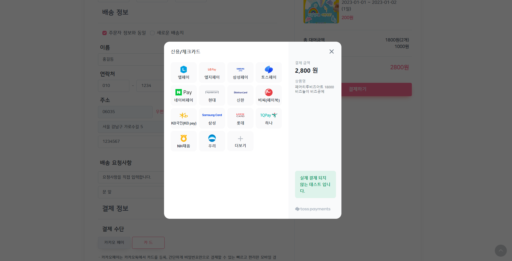
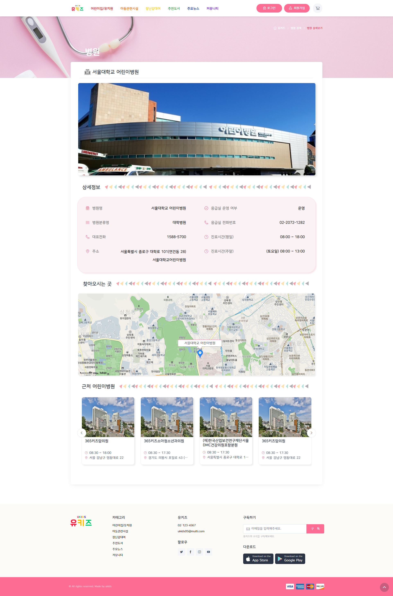

# Final-Project 개인개발(front)

 ~~~
 🎱 Final-Project 개인개발
     - header.html, footer.html
     - 장난감 상세페이지 (toy-detail.html)
     - 결제 페이지 (pay.html)
     - 아동복지시설 상세페이지 ( welfare-detail.html)
     - 병원 상세페이지 ( hospital-detail.html)
 ~~~


### 1. 헤더 푸터

- 헤더 - 로그아웃 위치 변경

### 2. 장난감 상세페이지 (toy-detail.html)

- 장난감 정보
- 대여기간 (flatpickr)
  - 배송기간으로 인해 today + 2일 부터 선택 가능
  - 대여반납일 먼저 클릭시 alert  ‘대여 시작일을 선택해주세요.’

[flatpickr](https://flatpickr.js.org/)

```html
<div class="mb-3" style="max-width: 30rem; margin-left: 35px; margin-right: 20px;">
  <div class="input-group"><span class="input-group-text"><i class="ci-calendar"></i></span>
    <input class="form-control date-picker" type="text" placeholder="대여시작일" id="start-date" onchange="changePickr()">
    <input class="form-control date-picker" type="text" placeholder="대여반납일" id="end-date" onclick="clickPickr()">
  </div>
</div>

//대여일 지정
  var today = new Date();
  var tmrw = new Date(today.setDate(today.getDate()+2));
  $("#start-date").flatpickr({
    monthSelectorType : 'static',
    locale: "ko",                            
    minDate: tmrw,
    dateFormat: "Y-m-d",
  });

function changePickr(){
  var date = new Date($("#start-date").val());
  date.setDate(date.getDate() + 1);
  $("#end-date").flatpickr({
    monthSelectorType : 'static',
    minDate : date,
    locale: "ko",  
    dateFormat: "Y-m-d"
  });
}

$("#end-date").flatpickr({
  monthSelectorType : 'static',
    locale: "ko",   
    minDate: tmrw,                  
    dateFormat: "Y-m-d",
    disable: [
      function(date) {
        // disable every multiple of 8
        return (date.getDate());
      }
    ]  
  });

function clickPickr(){
  if($('#start-date').val()==false){
    $("#end-date").flatpickr({
      monthSelectorType : 'static',
        locale: "ko",   
        minDate: tmrw,                  
        dateFormat: "Y-m-d",
        disable: [
          function(date) {
            // disable every multiple of 8
            return (date.getDate());
          }
        ]  
      });
      alert("대여 시작일을 선택해주세요.")
  }
}
```

- 장난감 상세정보

  - 상품정보 더 보기 , 상품정보 간략히

- 리뷰

  - 리뷰 더 보기, 리뷰 감추기

- 비슷한 장난감 (슬라이드)

- 장난감 상세보기 page

  

### 3. 결제 페이지 (pay.html)

- 주문자 정보

  - 이메일 셀렉트

- 배송 정보

  - 주문자 정보와 동일

    - 클릭시 주문자 정보 나오게

  - 우편번호

    [Daum 우편번호 서비스](https://postcode.map.daum.net/guide)

  - 배송 요청사항

    - ‘요청사항을 직접 입력합니다’ 클릭시 입력칸 나오게

- 결제 수단

  - 카드 클릭 후 결제하기 클릭하면 **토스 페이먼츠**로

  ```html
  <button class="btn btn-primary btn-shadow d-block w-100 mt-4 pay" type="submit" id="payment-button">결제하기</button>
  ```

  ```jsx
  var clientKey = '클라이언트 키'
  var tossPayments = TossPayments(clientKey) // 클라이언트 키로 초기화하기
  
  var button = document.getElementById('payment-button') // 결제하기 버튼
  
  function checkForm(){  
    // console.log('daafs');
    if($('#cardbtn').is(':checked')){
  
      tossPayments.requestPayment('카드', { // 결제 수단 파라미터
          // 결제 정보 파라미터
          amount: 2800,
          orderId: 'nCC9h5aZXtS4TA4hkNIX8',
          orderName: '페어리루비즈아트 18000 비즈놀이 비즈공예 유아장난감외 1건',
          customerName: '유키즈',
          successUrl: '<http://localhost:8080/success>',
          failUrl: '<http://localhost:8080/fail>',
        })
        .catch(function (error) {
          if (error.code === 'USER_CANCEL') {
            // 결제 고객이 결제창을 닫았을 때 에러 처리
          } else if (error.code === 'INVALID_CARD_COMPANY') {
            // 유효하지 않은 카드 코드에 대한 에러 처리
          }
        })
    }
    return false;
  }
  ```

- 주문자 동의

  - 모두 동의 클릭시 모두 선택 되게

  ```html
  <div class="mb-3 mx-3">
    <div class="form-check">
      <input class="form-check-input" type="checkbox" id="selectAll" name="terms" >
      <label class="form-check-label" for="selectAll" style="font-weight: 600;">결제대행서비스 약관에 모두 동의합니다.</label>
    </div>
    <div class="form-check">
      <input class="form-check-input" type="checkbox" id="ex-check-1" name="terms" required>
      <label class="form-check-label" for="ex-check-1">[필수] 대여 이용약관 동의 <a class="termscon" href="#">내용보기</a></label>
    </div>
    <div class="form-check">
      <input class="form-check-input" type="checkbox" id="ex-check-2" name="terms" required>
      <label class="form-check-label" for="ex-check-2">[필수] 개인정보 처리방침 동의 <a class="termscon" href="#">내용보기</a></label>
    </div>
    <div class="form-check">
      <input class="form-check-input" type="checkbox" id="ex-check-3" name="terms" >
      <label class="form-check-label" for="ex-check-3">전자금융거래 기본약관 <a class="termscon" href="#">내용보기</a></label>
    </div>
  </div>
  ```

  ```
  $(document).ready(function() {
    $("#selectAll").click(function() {
      if($("#selectAll").is(":checked")) $("input[name=terms]").prop("checked", true);
      else $("input[name=terms]").prop("checked", false);
    });
  
    $("input[name=terms]").click(function() {
      var total = $("input[name=terms]").length;
      var checked = $("input[name=terms]:checked").length;
  
      if(total != checked) $("#selectAll").prop("checked", false);
      else $("#selectAll").prop("checked", true); 
    });
  });
  ```

- 주문자정보, 배송정보, 결제수단 ,주문자동의(필수) 모두 입력했는 때 결제하기 넘어가게 하기

- 결제 page

  



### 4. 아동복지시설 상세페이지 ( welfare-detail.html)

- 지도 (카카오 지도 API)

  [Kakao 지도 API](https://apis.map.kakao.com/web/sample/addr2coord/)

  - 지도 인포윈도우 css 변경

    ```css
    .info-title{
      position: relative;
      padding:0px 10px;
    	background: #FFFFFF;
      display:inline-block;
    	border-radius: 5px;
    	border: #fc6c93 solid 1px;
      position: absolute;
    	text-align: center;
      line-height:32px;
      width: 200px;
      height: auto;
      left: -99px;
      bottom: 55px;
      margin: auto;
      white-space: pre-line;
    }
    
    .info-title:after {
      content: '';
    	position: absolute;
    	border-style: solid;
    	border-width: 14px 10px 0 11.5px;
    	border-color: #FFFFFF transparent;
    	display: block;
    	width: 0;
    	z-index: 1; 
    	right: 45%; 
      }
    
    .info-title:before{
      content: '';
      position: absolute;
      border-style: solid;
      border-width: 14px 10px 0 11.5px;
      border-color: #fc6c93 transparent;
      display: block;
      width: 0;
      z-index: 0;
      bottom: -15px;
      right: 45%;  
    }
    ```

- 아동복지시설 정보

- 근처 아동복지시설

- 아동복지시설 상세 page

  

### 5.병원 상세페이지 ( hospital-detail.html)

- 병원 정보

- 지도 (카카오 지도 API)

  [Kakao 지도 API](https://apis.map.kakao.com/web/sample/addr2coord/)

  - 지도 인포윈도우 css 변경

- 근처 어린이병원

- 병원 상세 page

  
