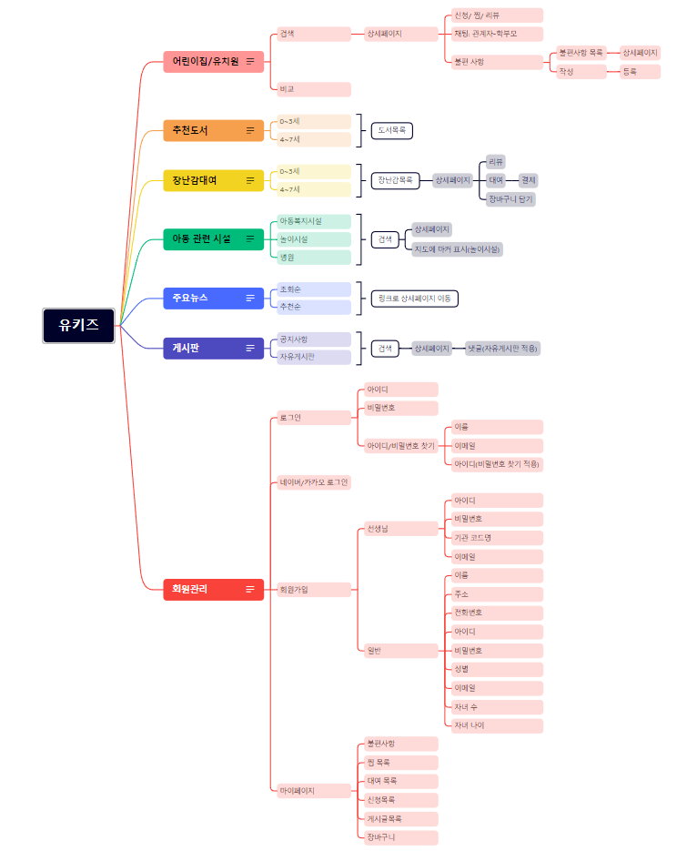
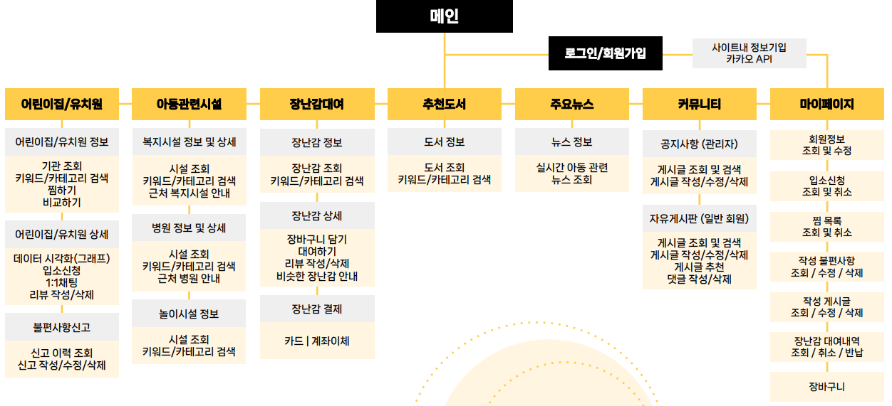

# Final-Project 기획

~~~
🍀 Final-project 기획
	- 구글드라이브 / 기획안
	- 사이트 맵 및기능리스트 작성
	- UI 설계
~~~

## 1. 구글드라이브

[5조 - 구글드라이브](https://drive.google.com/drive/folders/1z34KpBCallUG0NHJ0ShyVxjQFIpaSjHe)

## 2. 기획안 작성

1. 기획의도(목적) : 어린 자녀를 둔 학부모들을 위한 안심하고 맡길 수 있는 어린이집 소개 및 관련 정보제공
2. 주요분석 내용 : 어린이집은 아이가 또래 친구들과 사교성을 기르고 교육을 받는 중요한 공간이다. 이러한 공간에서 일어나는 사고와 최신 정보를 모아 아이에게 더 좋은 환경을 제공하고 싶은 부모들을 위한 정보 사이트 제작을 시작하게 되었습니다.
3. 기대 효과 : 학부모들의 어린이집에 대한 불안감 및 불신감 해소에 기여 어린이집에 대한 정확한 정보를 제공하여 어린이집 선택 시 도움을 줍니다.

[[KDT 3차] 지능형 웹서비스 풀스택 개발_프로젝트_기획안_5조(유키즈).docx](../project/%5BKDT%203차%5D%20지능형%20웹서비스%20풀스택%20개발_프로젝트_기획안_5조(유키즈).docx)

## 3. 사이트 맵 / 기능리스트

## 4. UI 흐름도

